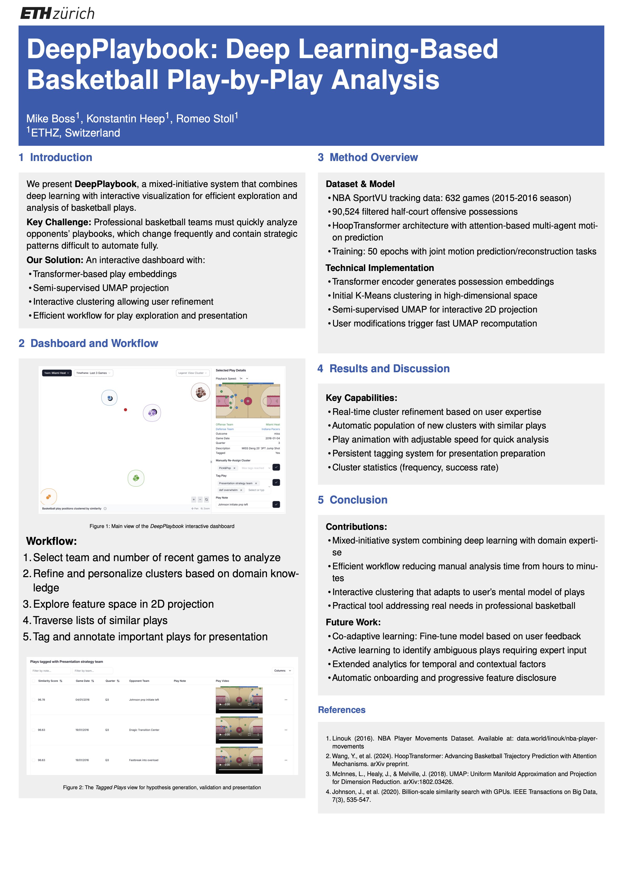

# Basketball Analytics Dashboard

The task of scouting an upcoming opponent in professional Basketball often requires hours of manual labor, with only a small proportion of it requiring the domain expertise of the coaches carrying out the task. Yet the task is not easily solved by an algorithm or an ML agent. We present the mixed-initiative system DeepPlaybook that enables easy exploration, organization and presentation of Basketball plays in an interactive dashboard with a semi-supervised projection and an interactive clustering fueled by a transformer model with a VAE bottleneck.

Try out the live version at [https://fp-p3.xaiml25.ivia.ch/](https://fp-p3.xaiml25.ivia.ch/)

## Team Members

1. Mike Boss
2. Konstantin Heep
3. Romeo Stoll

## Project Overview

This dashboard provides comprehensive analysis of NBA player movement patterns through:
- **Data visualization** of generated play clusterings and player tracking data
- **Machine learning models** for finding similar plays (using trajectory prediction)
- **Interactive components** for exploring opponent team offensive tactics

## Project



[Report](./assets/XAIML_report_DeepPlaybook.pdf)

## Architecture

```
basketball-analytics/
├── frontend/          # React.js dashboard with TypeScript
├── backend/           # Python API server with Flask API
├── backend/model/     # ML preprocessing, transformer model training pipeline
└── docker-compose.yml # Development environment
```

## Quick Start

### Prerequisites

- Docker and Docker Compose
- Node.js 18+ (for local frontend development)
- Python 3.13+ (for local backend development)

### Development Setup

1. **Clone and setup environment:**
   ```bash
   git clone <repository-url>
   cd basketball-analytics
   ```

2. **Start all services:**
   ```bash
   docker compose up
   ```
   
   Services will be available at:
   - Frontend: http://localhost:3000
   - Backend API: http://localhost:8080/api/v1/

### Individual Service Setup

For detailed setup instructions:
- **Frontend**: See [frontend/README.md](frontend/README.md)
- **Backend**: See [backend/README.md](backend/README.md)  
- **ML Models**: See [model/README.md](backend/src/backend/model/README.md)

## Data Pipeline

1. **Raw NBA tracking data** → Stored in `backend/data/nba_tracking_data/`
2. **Preprocessing** → ML model training and feature extraction
3. **Clustering** → Initial position clusters computed and cached
4. **Video rendering** → Synchronized tracking overlays
5. **API serving** → Data access for frontend and interaction loop for user feedback

## Development Workflow

### Working with Data

- **Adding teams**: Update `TEAM_IDS_SAMPLE` in `backend/settings.py`
- **Reprocessing data**: Run `uv run python scripts/prepare_data.py`
- **Updating clusters**: Run `uv run python src/backend/resources/scatter_data.py`
- **Regenerating videos**: Run `uv run python scripts/prerender_videos.py`

## Deployment

Automatically on merge to `main` branch by CI/CD pipeline.

## Resources

- **Pitch Video**: [Project Presentation](https://polybox.ethz.ch/index.php/s/bjtuIzQxFkGUOqX)
- **Documentation**: See individual component READMEs
